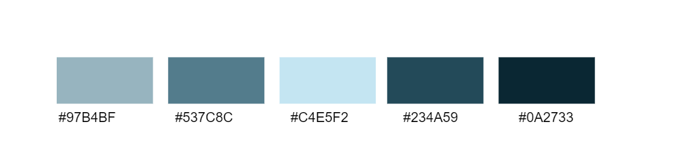
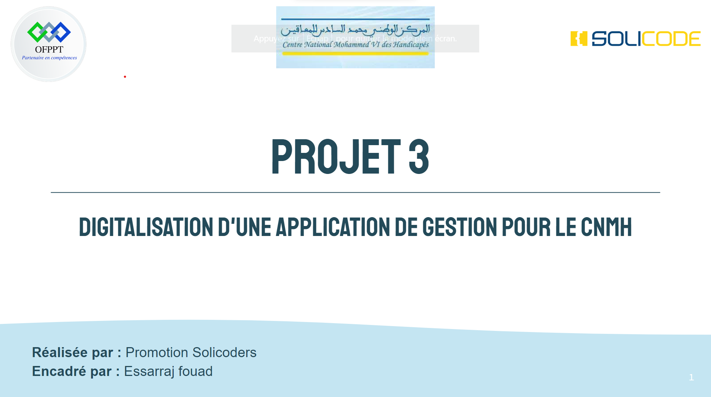

# La Charte Graphique:

Bienvenue dans notre guide de la charte graphique. Ce document a été créé pour garantir une cohérence visuelle et une identité forte dans notre projet.
1. ## Logo

2. ## Les couleurs

**Source:** 
[Adobe color](https://color.adobe.com/fr/create/color-wheel)

**Régle:** 
Monochrome de couleur #C4E5F2

**NB:** 
**L'arriére plan doit etre Blanc à cause des diagrammes UML.**

``
#97B4BF
#537C8C 
#C4E5F2 
#234A59 
#0A2733
``

3. ## Les fontes

- Arial ( pour les textes ) : Mercury is the closest planet to the Sun and the smallest one in the Solar System—it’s only a bit larger than our Moon.

- STAATLICHES ( pour les titres ) Mercury is the closest planet to the Sun and the smallest one in the Solar System—it’s only a bit larger than our Moon.

## Exemple:
 
